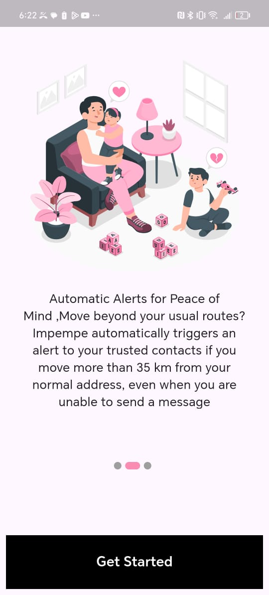
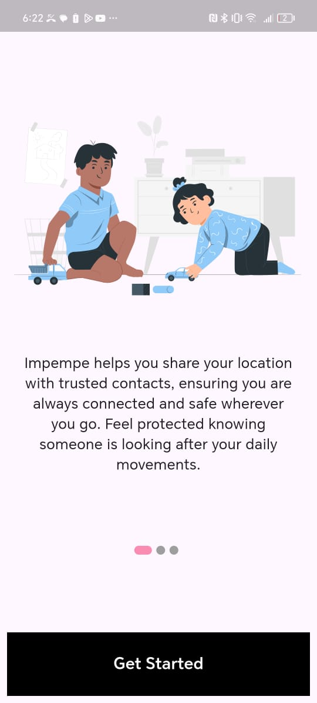
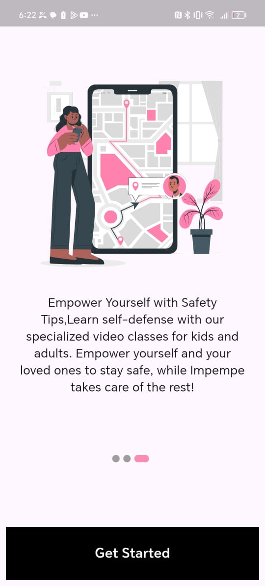
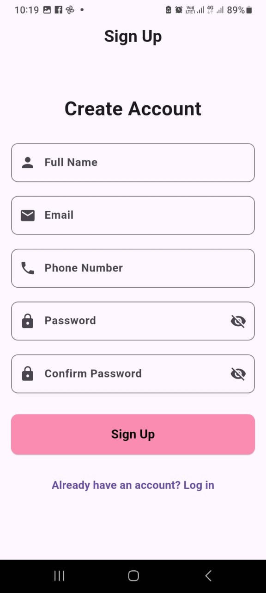
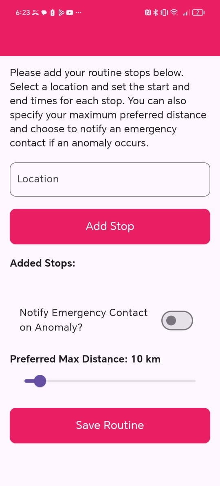
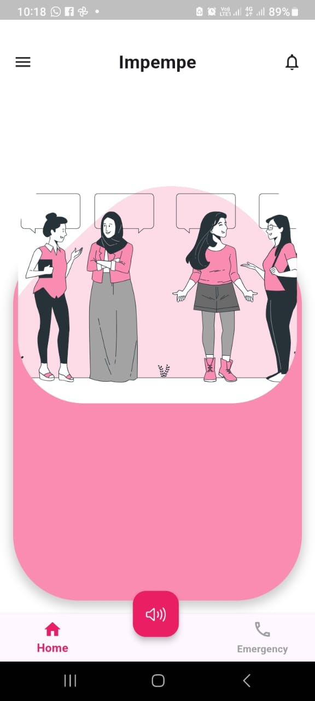

# Impempe - A Safety App for Women and Children

## Overview
Impempe is a safety-focused mobile application developed to address the pressing issue of safety for women and children in South Africa. With the rise in safety concerns, Impempe serves as a reliable tool designed to enhance protection and provide immediate response capabilities.

Key Features
1. Trusted Device Linking
Impempe allows users to link their app to trusted devices belonging to friends, family members, or guardians. These linked devices will receive real-time alerts during emergency situations, ensuring help is just a notification away.

3. Emergency Command Listening
Our app includes a unique voice-activated emergency command feature. Users can set up a secret command phrase that, when spoken, triggers the app to send their current location to their linked trusted devices without any additional input.

4. Defensive Training Videos
Impempe provides access to a library of self-defense videos to empower users with the knowledge and techniques needed to protect themselves in dangerous situations. This feature aims to enhance users’ preparedness and confidence.

5. Continuous Location Sharing
To increase safety, Impempe continuously shares users' locations with a secure database. This ensures that trusted individuals can always monitor the user’s whereabouts.

6. Emergency Call Button
The app features a prominent emergency button that users can press to quickly call for help. This feature ensures that immediate assistance can be requested with minimal effort.

7. Pattern Deviation Alerts
Impempe monitors users' typical movement patterns. If the app detects an unexpected deviation from these patterns, it sends a check-in notification to the user. If there is no response within a set timeframe, emergency alerts are automatically sent to the linked trusted devices.

Mission
The primary goal of Impempe is to contribute to the reduction of missing persons cases, specifically among women and children in South Africa. By integrating cutting-edge technology with user-friendly features, Impempe aims to offer peace of mind and practical support to those who need it most.

To View Our Work Here Is An APK LINK MVP: https://drive.google.com/file/d/1iqu4m2_Aqd21D9_lBmwOScjlnsMvevMw/view?usp=sharing

  
  
  
  
  
  
  
  
  

